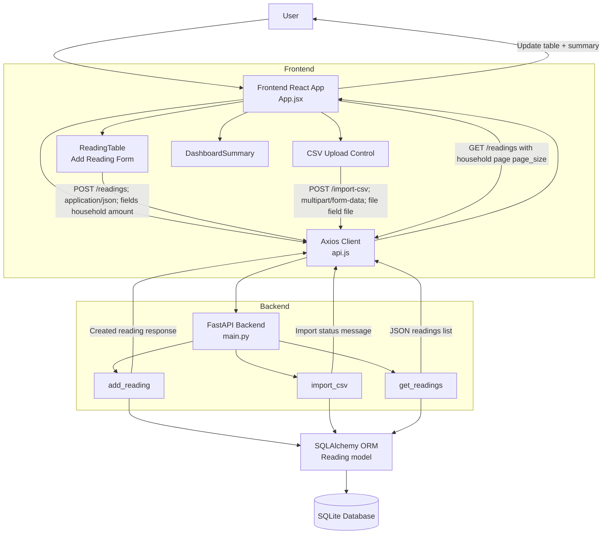

# Implementation Workflow

## End-to-End Workflow Graph

```mermaid
flowchart TD
    U[User] --> FE[Frontend React App<br>App.jsx]

    subgraph Frontend
      FE --> RT[ReadingTable<br>Add Reading Form]
      FE --> CSV[CSV Upload Control]
      FE --> DS[DashboardSummary]
      FE --> API[Axios Client<br>api.js]
    end

    RT -->|POST /readings; application/json; fields household amount| API
    CSV -->|POST /import-csv; multipart/form-data; file field file| API
    FE -->|GET /readings with household page page_size| API

    API --> BE[FastAPI Backend<br>main.py]

    subgraph Backend
      BE --> AR[add_reading]
      BE --> IR[import_csv]
      BE --> GR[get_readings]
    end

    AR --> ORM[SQLAlchemy ORM<br>Reading model]
    IR --> ORM
    GR --> ORM

    ORM --> DB[(SQLite Database)]

    GR -->|JSON readings list| API
    AR -->|Created reading response| API
    IR -->|Import status message| API

    API --> FE
    FE -->|Update table + summary| U
```
